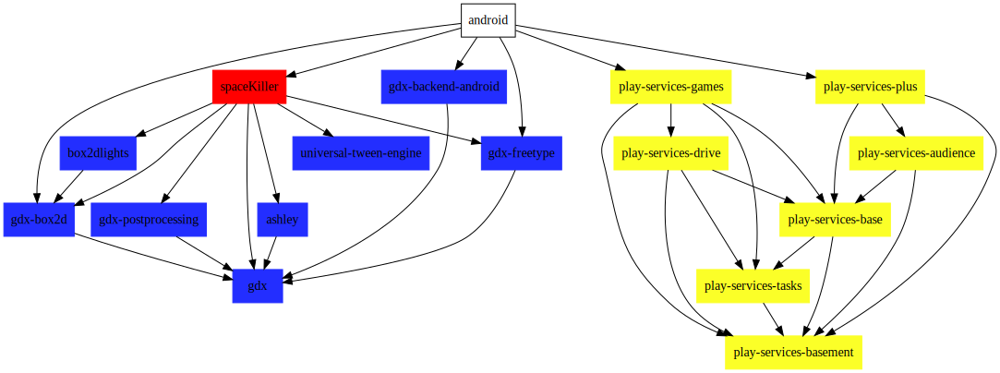

# SPACE KILLER [](https://www.codefactor.io/repository/github/benjaminlefevre/bendk97-space-killer) [](https://www.codacy.com/app/benjaminlefevre/bendk97-space-killer?utm_source=github.com&amp;utm_medium=referral&amp;utm_content=benjaminlefevre/bendk97-space-killer&amp;utm_campaign=Badge_Grade) [](https://travis-ci.org/benjaminlefevre/space-killer) [](https://coveralls.io/github/benjaminlefevre/bendk97-space-killer?branch=master) [](LICENSE)


Space Killer is a shmup game (shoot'em up) developed with libgdx, a cross-platform java game development.
The game is currently published in the google playstore here: [Space Killer](https://play.google.com/store/apps/details?id=com.benk97.space.killer&hl=en_US)

Several libraries are used:

| Library                     | Version | Link                                                                                     |
| --------------------------- | ------- | ---------------------------------------------------------------------------------------- |
| libgdx                      | 1.9.8   | [Libgdx](https://libgdx.badlogicgames.com/) - [GitHub](https://github.com/libgdx/libgdx) |
| ashley (ECS design pattern) | 1.7.3   | [Ashley](https://github.com/libgdx/ashley)                                               |
| box2DLights                 | 1.4     | [Box2DLights](https://github.com/libgdx/box2dlights)                                     |
| Tween Universal Engine      | 6.3.3   | [Tween](https://github.com/AurelienRibon/universal-tween-engine)                         |
| gdx-postprocessing          | 1.0.8   | [gdx-postprocessing](https://github.com/Anuken/gdx-postprocessing)                       |

The game is only tested and compiled for android platforms :
```bash
# debug 
./gradlew clean assembleUnsignedDebug check
# release
./gradlew clean assembleUnsignedRelease check
# release signed and aligned (you have to provide a keystore.properties in root directory and a keystore file in android directory)
./gradlew clean assembleSignedRelease check 
```
But as libgdx is cross-platform, it should be easy to compile for HTML5, iOS...and so on

## Dependency graph

Generated with this [gradle plugin](https://github.com/vanniktech/gradle-dependency-graph-generator-plugin)



## LICENSE

This project is licenced under the MIT license.

For more details check the [LICENCE](LICENSE) file

## CI
Travis CI is installed to build every Pull Requests and the master on a daily basis.
